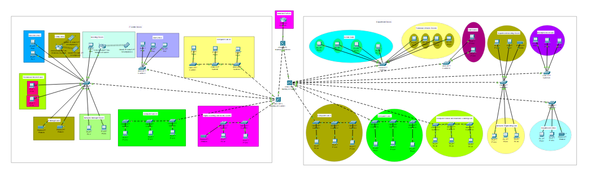

# CISCO-Network-Design
# University Network Design

## Introduction
This repository contains the network design for the IT Centre and Department building at the university. It includes subnets, VLANs, and configurations to meet specific requirements.

## Network Diagram

### IT Centre Block
The IT Centre Block includes:
- Director Office
- Network Manager Room
- Technical Officers Rooms
- Staff Office
- Meeting Room
- Lobby (WiFi Coverage)
- Computer Lab 1
- Computer Lab 2
- Digital Learning Centre
- Printing Room

### Department Block
The Department Block includes:
- Lecture Halls
- Staff Rooms
- Technical Officers Rooms
- Department Meeting Room
- Computer Lab 1
- Computer Lab 2
- Network Engineering Lab
- Microprocessor Lab
- Computer Vision and Machine Learning Lab
- Department Office

## Steps to Configure Routers and Switches
Provide detailed steps and configurations for routers and switches.

## WiFi Access Points Configuration
Provide detailed configurations for WiFi access points.

## Additional Notes
Include any additional notes or considerations for the network design.
